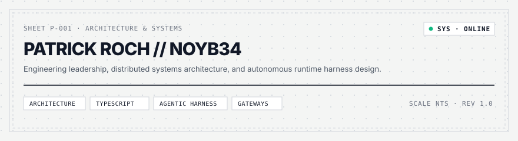
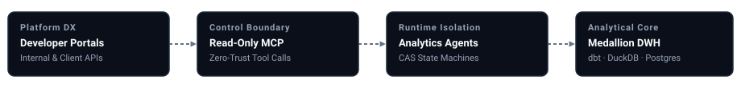

  

# Patrick Roch

## Architecting Intelligent Businesses

> **Innovation creates possibilities. Systems create businesses.**

**VP, Platform Product Management & Solution Architecture**

I design the platforms, agent systems, data foundations, and operating models that turn emerging technologies into scalable products and businesses.

My work connects customer problems, product economics, and technical execution. The focus is on systems that teams can depend on and operating models that make ownership, cost, and acceptance explicit.

[Personal site](https://noyb34.github.io/) · [Operating Autonomous Fleets](https://noyb34.github.io/autonomous-fleets/) · [LinkedIn](https://linkedin.com/in/patrickroch)

---

### Platforms, intelligence, product, and business

I work across four related areas.

| Pillar | Questions I work on | Systems and disciplines |
| :--- | :--- | :--- |
| **Platforms** | How can teams build on a capability and depend on it? | Developer ecosystems · APIs · AI platforms · Cloud architecture |
| **Intelligence** | How does data support decisions and accountable action? | Agent systems · Analytics · Data foundations · Decision engines |
| **Product** | What customer problem is worth solving, and can the economics work? | Product architecture · Platform economics · API monetization |
| **Business** | Who owns the outcome, and how does the organization learn? | Operating models · Autonomous organizations · Business experiments |

---

`DRAWING SET P-100`
### ACTIVE ARCHITECTURES & REPOSITORIES

These public projects connect operating decisions, application workflows, and data foundations.

| REF | COMPONENT | FOCUS | SPEC |
| :--- | :--- | :--- | :--- |
| `01 · OPS` | **[Operating Autonomous Fleets](https://noyb34.github.io/autonomous-fleets/)** | Operating-model reference: authority, budgets, acceptance evidence, and recovery. Four draft outlines with editable templates. | `AGENTS` `OPERATIONS` `SCHEMAS` |
| `02 · APP` | **[streamExcel-light](https://github.com/noyb34/streamExcel-light)** | Excel conversion application with a preview and editing step before JSON or XML export. | `PYTHON` `FASTAPI` `STREAMLIT` |
| `03 · DATA` | **[mssqsl-postgres-dlt-pipeline](https://github.com/noyb34/mssqsl-postgres-dlt-pipeline)** | Incremental data pipeline from SQL Server to PostgreSQL as a foundation for downstream analytics. | `PYTHON` `DLT` `POSTGRESQL` |

---

### Platform System Architecture

---

### Core Focus & Systems Built

* **Enterprise Developer Platforms & DX:** Architected dual-surface (internal & client-facing) developer portals. Designed OpenAPI contracts, sandbox validation environments, and developer ergonomics that treat platform APIs as revenue-generating products.
* **Agent Gateways & MCP Runtimes:** Engineering read-only Model Context Protocol (MCP) services and secure tool-calling boundaries to expose enterprise APIs and warehouse layers to autonomous agents under strict runtime isolation and zero-trust execution budgets.
* **Modern Analytical Data Foundations:** Structuring medallion architectures (Bronze / Silver / Gold) using dbt for relational models, DuckDB for in-memory vectorized processing, and PostgreSQL configured and tuned as an analytical warehouse.
* **Autonomous Decision & Analytics Agents:** Designing deterministic execution boundaries, tool-calling validation gates, and state-machine transitions (CAS) for specialized analytical agents.
* **Containerized Cloud Infrastructure:** Architecting automated CI/CD deployment pipelines to containerized AWS ECS Fargate microservices, with multi-cloud topology design across AWS and Azure.

---

### Systems & Architectural Matrix

| Architectural Layer | Core Technologies, Runtimes & Tooling |
| :--- | :--- |
| **Developer Surfaces** | Internal & Client-Facing Portals · OpenAPI 3.0 · REST · Interactive Sandboxes |
| **Agent Gateways & Control** | Read-Only MCP · Tool Calling · State Machine Boundaries (CAS) · Python · Rust |
| **Data Warehouse & Engines** | dbt · DuckDB (Vectorized Processing) · PostgreSQL (Analytical DWH) · Parquet |
| **Cloud & Runtime Ops** | AWS (ECS Fargate) · Azure · Docker · Automated CI/CD · Linux Toolchains |
| **Commercial Platform Strategy** | Platform Unit Economics · API Monetization · Solution Architecture |

---

### Operating theses

These principles guide how I evaluate products and the systems that support them.

1. Architecture is a business decision. Evaluate it against customer needs, delivery cost, and the ability to change.
2. A product strategy starts with a customer problem and a reason to pay for the outcome.
3. APIs become products when people can depend on their contracts, support, and economics.
4. Measure the full cost of an accepted business outcome, including review and recovery.
5. Give autonomous work an accountable owner, a spending limit, and evidence for acceptance.
6. An analytics agent depends on the SQL models and schema contracts feeding its context.
7. Infrastructure should make products easier to deliver and operate.
8. Use bounded, testable state transitions where decisions require predictable control.

---

**Build → Operate → Learn → Explain**

Washington DC Metro / Global

**Connect:** [Personal site](https://noyb34.github.io/) · [LinkedIn](https://linkedin.com/in/patrickroch) · `githubconnect@proch.8shield.net`
